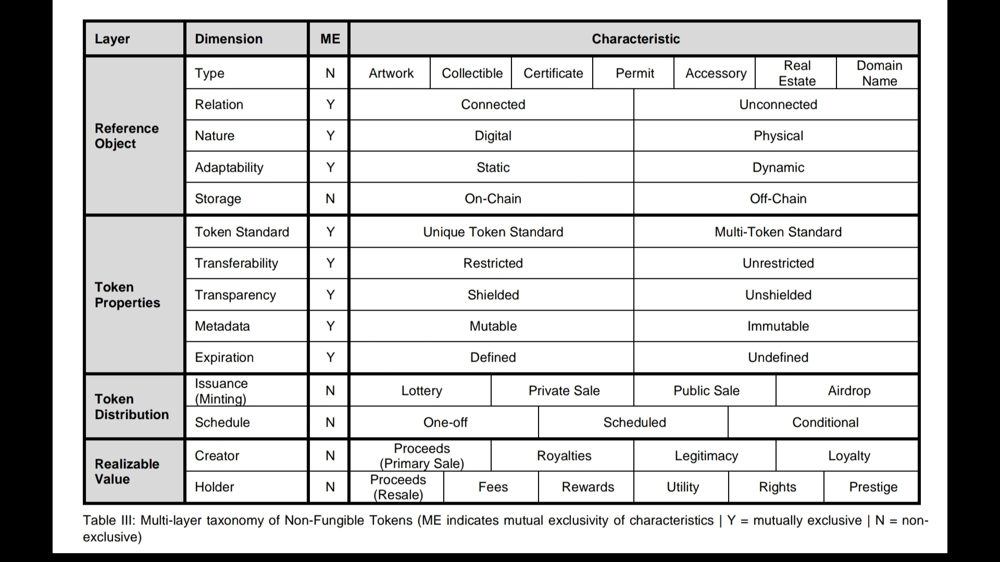

# Taxonomía de los NFTs

Al adentrarnos en el ecosistema de los NFTs, nos encontramos con una diversidad asombrosa de tokens, cada uno con su propósito, valor y funcionalidad únicos. Para navegar y operar efectivamente en este espacio, necesitamos un marco claro que nos permita entender, clasificar y diferenciar entre los distintos tipos de NFTs. Aquí es donde la taxonomía de los NFTs se convierte en una herramienta invaluable.

### La Importancia de una Taxonomía Clara

Una taxonomía de NFTs bien definida nos obliga a hacer preguntas fundamentales sobre lo que queremos que nuestro token represente y las funcionalidades que debe tener. Esto no es solo académico; tiene implicaciones prácticas que afectan desde la acuñación hasta la gestión de la vida útil del NFT. Por ejemplo, ¿nuestro NFT será un objeto de arte digital coleccionable o actuará como un certificado que concede ciertos derechos a su titular? La respuesta determinará cómo diseñamos nuestro smart contract y cómo lo introducimos al mercado.

### Atributos y Funcionalidad Clave

Antes de crear un NFT, debemos definir varios atributos: ¿Será un elemento estático o dinámico? ¿Cómo se manejarán el almacenamiento y la transferibilidad? ¿Qué estándares del token se aplicarán? Además, la taxonomía nos ayuda a decidir cómo se distribuirá el NFT: ¿Será a través de una venta pública, una lotería o un airdrop? Y no menos importante, ¿qué tipo de valor realizables ofrecerá tanto para el creador como para el titular?

### Aplicando la Taxonomía en la Práctica

La tabla que presentamos a continuación, extraída del análisis detallado del papel académico en arXiv, sirve como un punto de partida para estas consideraciones. Divide los atributos y características de los NFTs en varias categorías clave, cada una con opciones mutuamente exclusivas que nos ayudan a delinear el contorno preciso de nuestro token.

<figure><figcaption></figcaption></figure>

A medida que avanzamos a través de cada sección de la taxonomía, mantendremos un enfoque práctico, siempre preguntándonos cómo cada decisión afecta la funcionalidad y el potencial del NFT. Este proceso no solo es crucial para el diseño técnico, sino también para la estrategia de mercado y la planificación a largo plazo del ecosistema del token.

### Conclusión

Entender la taxonomía de los NFTs es el primer paso esencial para cualquier creador o emprendedor en el espacio blockchain. Permite una comprensión profunda de los activos que estamos creando y cómo se alinean con los objetivos y necesidades de nuestra audiencia. Ahora, vamos a explorar cada una de estas categorías taxonómicas y a descubrir cómo pueden guiar la creación de un NFT exitoso y significativo.
